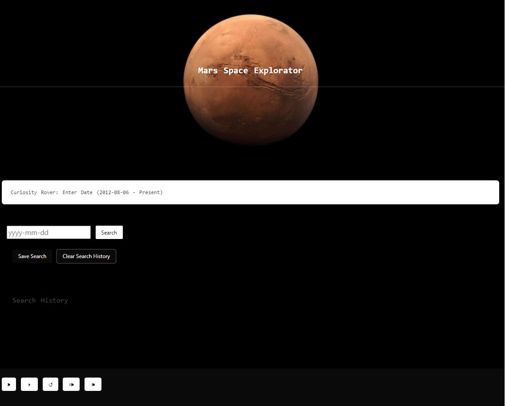

# Mars Exploration app


## Description

Space exploration is always exciting and the latest discovery that has been done in Mars via curiosity are just mind boggling.  
That is why Mars Exploration app is unique and fun.

- With this project with provide Mars explration's lovers with a platform where to search the latest pictures from curiosity while enjoying a relaxing music.

## Table of Contents 

- [Webpage-Preview](#Webpage-Preview)
- [Code-Snippet](#Code-Snippet)
- [Custom-Features](#Custom-Features)
- [Usage](#Usage)
- [Skill-Improved](#Skill-Improved)
- [Technologies](#Technologies)
- [Authors](#Authors)
- [Credits](#credits)


## Webpage Preview

No installation required. Just an uptodate browser.

## Code-Snippet
Java script
#Funtion to Handle Form

```
var formSubmitHandler = function (event) {   // when clicked, this is run
  event.preventDefault();
  var usersSearchInput = searchFieldInput.value    // sets a variable from the info typed in the field
console.log(usersSearchInput)
getSearch(usersSearchInput) 
}
```
#Function to handle search

```
vvar getSearch = function (usersSearchInput) {
// Useable Api Urls
var apiUrl = 'https://api.nasa.gov/mars-photos/api/v1/rovers/curiosity/photos?earth_date=' + usersSearchInput +  '&z&api_key=0kRnAVYNc2gsCR3nOYw7LjB2uBvKsB75RLIkT25q' 
console.log(usersSearchInput)
}
```
#Function to display photos

```
function displayPhotos(imgURL){
  if(cameraName == "Mast Camera" ){   //  prevents Mast camera photos from loading, because they dont look very good
    return;
  }else{
  var img = document.createElement("img");
  img.src = imgURL;
  img.title = cameraName;
  // document.body.appendChild(img);        //  adds it to the <body> tag
  displayEl.appendChild(img);      
  }
}
```


## Custome-Features
- 🌕 Search box with format of year-month-day.
- 🌕 Music player with mute button, play/pause button, restart music, volume up/down, 
- 🌕 Display curiosity pictures for the day input.


## Usage
The link of the webpage is: -------
1. Load the webpage.
2. Click on the search box
3. Enter your search criteria in the format of yyy-m-dd.
4. Sit and relax and scroll through your favorite Mars's curiosity photos.

Webpage use example:


    ```md
    
    ```
## Skills Improved
- 🌕CSS styling: bootstrap, bulma
- 🌕 Web APIs Local Storage
- 🌕 Event Listener
- 🌕 Setting Attributes
- 🌕 Creating Iframes

## Technologies
 -[HTML](#HTML)
 -[CSS](#CSS)
 -[JavaScript](#JavaScript)
## License
[License](#MIT)
## Authors
- [Brian-King](#Brian King https://github.com/kingbgreen5) 
- [CarrTe-Alexander-(CJ)](#CarrTe Alexander (CJ) https://github.com/carrtealexander)
- [Carmen-Jimenez](#Carmen Jimenez https://github.com/clcoder2425/)

## Credits

- [W3School](W3School)
- [StackOverflow](https://stackoverflow.com)
- [NASA API](https://api.nasa.gov/)
- [Youtube-API](https://developers.google.com/youtube/v3/quickstart/js)
List your collaborators, if any, with links to their GitHub profiles.

nasa api link
youtube api

If you used any third-party assets that require attribution, list the creators with links to their primary web presence in this section.

If you followed tutorials, include links to those here as well.


---

